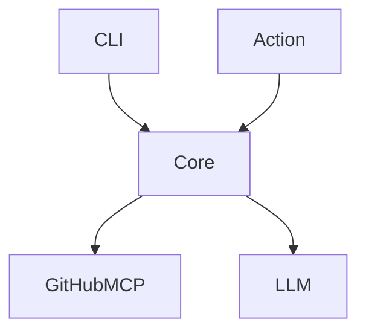

# README template + one-screen architecture map

Špecifikácia podľa [`../zadanie.txt`](../zadanie.txt) — **bez rozšírenia scope**.  
SDD: tech spec generovania; nadväzuje na [`04-ziskanie-obsahu-github.md`](./04-ziskanie-obsahu-github.md).

> **Zadanie:** *clean README* + *one-screen architecture map* — onboarding / „jump to exploration“.  
> **Quick start:** *generate a README from a template*.

---

## 1. Čo zadanie vyžaduje

| Bod zadania | Význam |
|-------------|---------|
| Clean README | Čitateľný onboarding README v Markdown |
| **from a template** | Fixná štruktúra sekcií; agent **vyplní** template, nie free-form román |
| One-screen architecture map | Jedna prehľadová mapa (zmestí sa na jeden screen) |
| Jump to exploration | Cieľ = rýchly štart do codebase, nie plná docs site |

**Vstup tohto kroku:** kontext z ingestu (file tree + vybrané súbory) — [`04`](./04-ziskanie-obsahu-github.md).  
**Výstup tohto kroku:** Markdown artefakty pripravené na doručenie (Action komentár / API) — špec doručenia neskôr.

---

## 2. Scope

### In scope
- README **template** — default šablóna + **plne konfigurovateľná** výstupná šablóna (§4.1)
- One-screen **architecture map** (formát + pravidlá)
- AI agent generuje výstup podľa načítanej šablóny z ingest kontextu
- Výstup vhodný na vloženie do PR komentára a/alebo ako README body

### Out of scope
- Docs site, multi-page docs, OpenAPI reference (Mintlify-level)
- Quality / security report
- Auto-commit README do default branch
- Viacúrovňové C4 / drill-down mapy (nie „one screen“)

---

## 3. Vstup → výstup

```
Ingest (tree + files)  +  configurable README template  +  map rules
        │
        ▼
   AI agent
        │
        ├── README.md  (vyplnená šablóna)
        └── Architecture map (blok do README / PR podľa configu)
```

Oba výstupy sú **Markdown**. Mapa: README (ak placeholder) + PR komentár + samostatný súbor.

---

## 4. README template (výstupná šablóna)

Zadanie vyžaduje README **from a template**. V projekte je šablóna **konfigurovateľná**: default nižšie je východisko; reálny beh používa template z configu.

### 4.1 Konfigurovateľnosť šablóny (povinné v implementácii)

| Čo | Ako |
|----|-----|
| Súbor šablóny | Cesta v projekte, napr. `templates/readme.md` (alebo env `DOCWRIGHT_README_TEMPLATE`) |
| Placeholdery | `{{name}}` — agent ich vyplní; neznámy placeholder = chyba alebo prázdne podľa configu |
| Jazyk / tón | Voliteľné inštrukcie v configu (`output_language`, `tone`) vedľa šablóny |
| Mapa v šablóne | Placeholder napr. `{{architecture_map}}` — musí byť v šablóne, ak má byť mapa vo výstupe |

**Pravidlá:**
- Default šablóna = §4.2 (vstavaná / shipped s projektom).
- Custom šablóna **nahrádza** default celú — žiadne hardcode sekcie mimo načítaného súboru.
- Zmena výstupu = úprava template/config, nie zmena agent logiky.
- Action / Public API môžu predať override cesty k template (voliteľné).

```text
config.readme_template_path  →  load template  →  agent fills placeholders  →  readmeMarkdown
```

### 4.2 Default šablóna (východisko)

```markdown
# {{project_name}}

{{one_liner}}

## What it is
{{what_it_is}}

## Quick start
{{quick_start}}

## Architecture
{{architecture_map}}

## Repository layout
{{repo_layout}}

## Key commands
{{key_commands}}

## Configuration
{{configuration}}

## License
{{license}}
```

| Placeholder | Obsah (max) | Zdroj dát (orientačne) |
|-------------|-------------|-------------------------|
| `project_name` / `one_liner` | Názov + 1 veta | `owner/repo`, existujúci README, description |
| `what_it_is` | 1 krátky odsek (3–6 viet) | README, manifests, entry points |
| `quick_start` | Kroky clone / install / run ak vieme | manifests, README, Makefile |
| `architecture_map` | One-screen mapa (§5) | tree + entry points |
| `repo_layout` | Skrátený tree / top-level | file tree |
| `key_commands` | npm scripts, make, … | package.json, Makefile, … |
| `configuration` | Env / config ak nájdené | `.env.example`, config files |
| `license` | SPDX / názov alebo placeholder | LICENSE, repo meta |

### 4.3 Pravidlá vyplnenia

- Agent vyplní **načítanú** šablónu (default alebo custom).
- Chýbajúce dáta → krátky placeholder (`_Not detected from repo._`), nevynechávať celú sekciu ak heading v šablóne je.
- Žiadne vymyslené API / príkazy mimo ingest kontextu.
- Existujúci README v repo: **merge faktov** do výstupu podľa šablóny (fakty zo starého README + tree/files → nový čistý text). Action/API **necommití** do default branch — výstup ide do komentára / artefaktov.
- „Clean“ = krátke sekcie; Quick start a Architecture majú prioritu pri dĺžke.
- Bez marketing fluff a emoji spam.

**Jazyk:** default **`en`**; prepínateľné na **`sk`** (config / env / API), napr. `DOCWRIGHT_OUTPUT_LANGUAGE=sk`.

**Dĺžka sekcií:**
- **Soft (default):** limity v prompte (napr. What it is ≤ ~120 slov).
- **Hard (voliteľné):** ak je v configu `max_section_chars` (alebo per-section), po generate orezať prekročenie. Default = hard vypnutý.

---

## 5. One-screen architecture map

### 5.1 Význam „one-screen“

- **Jedna** diagramová jednotka + max krátky legend odsek (≤ 5 riadkov).
- Zobrazuje hlavné časti systému a vzťahy (napr. app → API → DB; packages; client/server).
- **Nie:** viac diagramov, nested drill-down, plný C4 L1–L4 pack.

### 5.2 Formát (uzavreté pre MVP)

| Položka | Hodnota |
|---------|---------|
| Syntax | **Mermaid** v Markdown fenced block (` ```mermaid `) |
| Preferovaný typ | `flowchart` (TB alebo LR) — jednoduchý prehľad |
| Prečo Mermaid | Render na GitHub (README + PR komentár); textový; sedí k Markdown výstupu |

Ak Mermaid zlyhá validáciou: **1× retry** opravy; ak stále nevalidné → **text fallback** (odrážkový boxes-and-arrows), stále one-screen. Run **nefailuje** len kvôli mape.

### 5.3 Pravidlá mapy

- Max **~12 uzlov** (default; konfigurovateľné) — inak to nie je one-screen.
- Uzly = reálne časti z tree / kódu (nie fantómové služby).
- Hrany = skutočné / silne odvodené závislosti; nepridávať „Marketing“, „Users“ ak to repo nie je produktový SaaS diagram.
- Žiadne detaily tried / každej funkcie.

### 5.4 Príklad tvaru (nie obsah)



---

## 6. Spoločný výstupný artefakt

```ts
type GenerateDocsOutput = {
  readmeMarkdown: string;           // README podľa (konfigurovateľnej) šablóny
  architectureMermaid: string;      // mermaid (alebo prázdne pri text fallback)
  architectureMarkdownFile: string; // samostatný súbor, napr. contents pre architecture.md
  architectureFallbackText?: string;
  warnings: string[];
};
```

**Kde sa mapa objaví (uzavreté):**
1. V README — ak šablóna obsahuje `{{architecture_map}}`
2. V **PR komentári** — vždy (povinné zo zadania / onboarding)
3. Ako **samostatný súbor** v artefaktoch (napr. `ARCHITECTURE.md`) — vždy v generate výstupe; commit do repo len ak to dovolí delivery spec (Action default = komentár, nie auto-merge)

Custom šablóna **bez** `{{architecture_map}}`: README mapu nemá; mapa **aj tak** ide do API response, PR komentára a samostatného súboru.

---

## 7. Agent správanie (stručne)

1. Vziať ingest kontext (tree + files, limity z [`04`](./04-ziskanie-obsahu-github.md)).
2. **Jeden LLM pass:** vyplniť šablónu + vygenerovať Mermaid mapu naraz (merge faktov z existujúceho README ak je).
3. Vložiť mapu do `{{architecture_map}}` ak je v šablóne; vždy pripraviť PR blok + samostatný súbor.
4. Validácia Mermaid → pri zlyhaní **1× retry len na mapu**; stále fail → text fallback.
5. Soft limity dĺžky (prompt); ak config hard cap → truncate.
6. Skontrolovať limity uzlov mapy.

Model / provider: konfigurovateľné; zadanie vyžaduje **AI agent**, nie konkrétny vendor.

---

## 8. Riziká

| Riziko | Dopad | Mitigácia |
|--------|-------|-----------|
| Halucinácie príkazov / architektúry | Zavádzajúci onboarding | Placeholder rule; viazať sa na tree/files |
| Mapa príliš detailná | Nie one-screen | Max uzlov; flowchart only |
| Nevalidný Mermaid | Nerenderuje sa na GitHub | Jedna oprava + text fallback |
| LLM $ | Náklady | Ingest limity z `04`; **1 pass** + lacný Mermaid-only retry |
| Dlhý README | Nie „clean“ | Soft prompt limity; voliteľný hard cap |

---

## 9. Acceptance

- [ ] README z **konfigurovateľnej** šablóny (§4.1); default = §4.2
- [ ] `output_language`: default `en`, prepínateľné na `sk`
- [ ] Existujúci README: **merge faktov** do template výstupu
- [ ] Mapa: v PR komentári + samostatný súbor vždy; v README ak je v šablóne
- [ ] Custom template bez `{{architecture_map}}` → mapa stále v API / komentári / súbore
- [ ] Max uzlov mapy default **12**, konfigurovateľné
- [ ] Generovanie: **1 LLM pass** + Mermaid-only retry + text fallback
- [ ] Dĺžka sekcií: soft v prompte; voliteľný hard cap v configu
- [ ] Žiadna docs site, quality/security, auto-merge na main

**Stav dokumentu:** generovanie README + mapy — **uzavreté** pre SDD.  
Ďalší krok: [`06-dorucenie-action-api.md`](./06-dorucenie-action-api.md).

---

## 10. Rozhodnutia (uzavreté)

| # | Rozhodnutie |
|---|-------------|
| 1 | Mapa: **README** (ak placeholder) + **PR komentár** + **samostatný súbor** |
| 2 | Jazyk: default **EN**, prepínateľné na **SK** |
| 3 | Max uzlov: **12**, konfigurovateľné |
| 4 | Existujúci README: **merge faktov** do template výstupu |
| 5 | Bez `{{architecture_map}}` → mapa **aj tak** v API / komentári / súbore |
| 6 | Nevalidný Mermaid → **retry + text fallback** |
| 7 | Dĺžka sekcií: **soft** (prompt) + **voliteľný hard** cap v configu |
| 8 | **Jeden LLM pass** + Mermaid-only retry (nie druhý plný README pass) |
